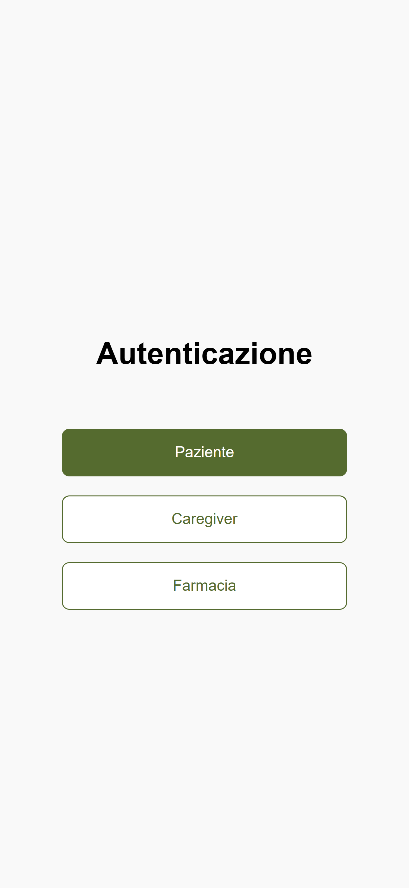
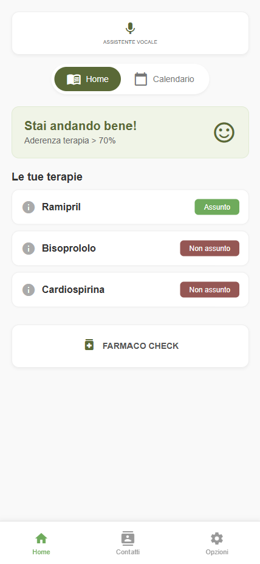
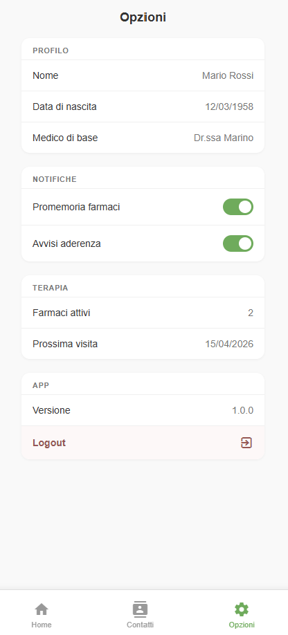
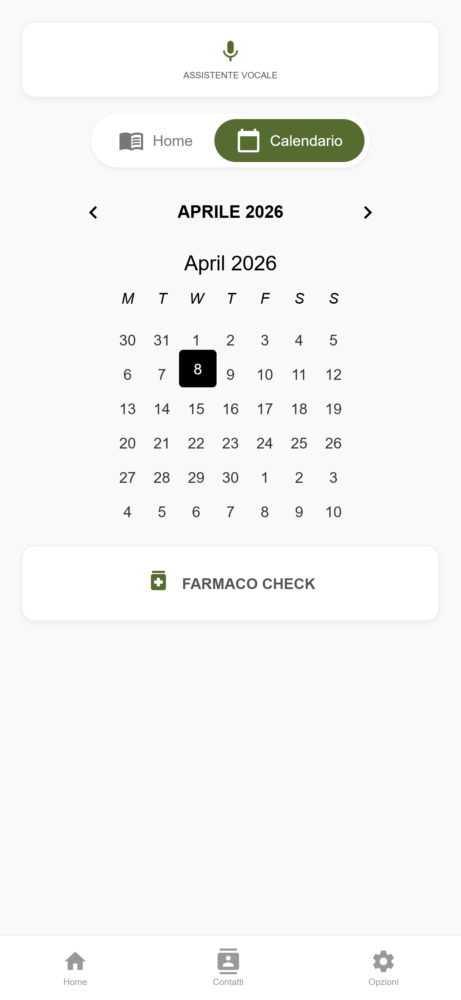
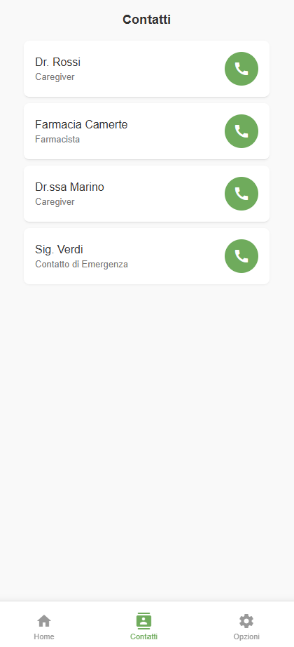
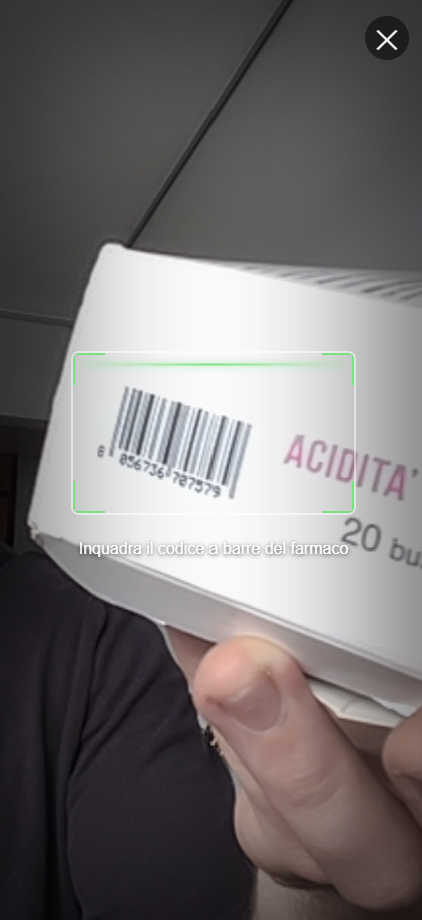
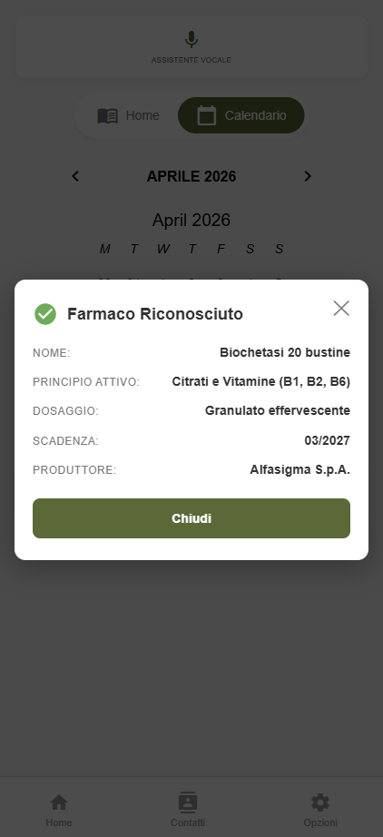
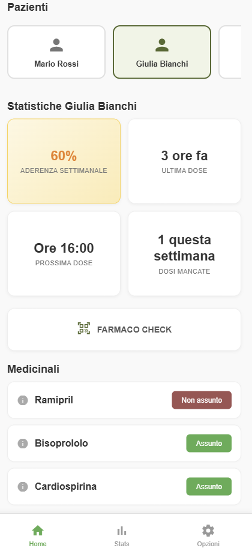
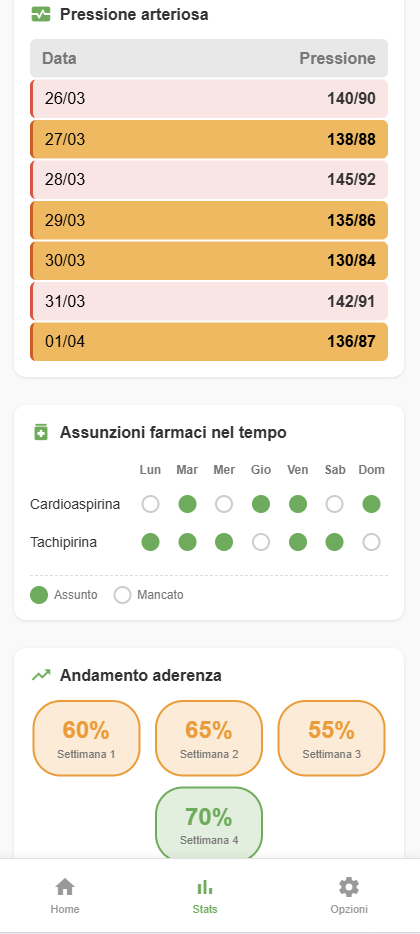
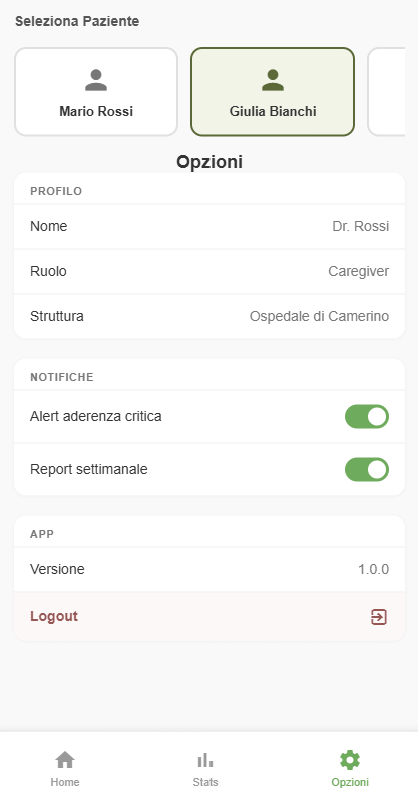

# HealthApp — Gestione della Terapia Farmacologica

HealthApp è un'applicazione web sviluppata nell'ambito di una tesi in farmacia, con l'obiettivo di migliorare l'**aderenza terapeutica** dei pazienti — ovvero la capacità di seguire correttamente e con costanza le terapie prescritte dal medico.

L'applicazione è pensata per essere semplice e accessibile a tutti: non è necessaria alcuna competenza tecnica per utilizzarla.

---

## Perché è utile

Uno dei problemi più diffusi in ambito sanitario è la scarsa aderenza terapeutica: molti pazienti dimenticano di assumere i farmaci, saltano delle dosi o non rispettano gli orari. Questo ha conseguenze dirette sulla salute e aumenta i costi del sistema sanitario.

HealthApp nasce per rispondere a questo problema, offrendo uno strumento digitale che permette a pazienti, caregiver e farmacisti di tenere tutto sotto controllo in modo semplice e immediato, direttamente dallo smartphone o dal computer.

---

## A chi è rivolta

L'applicazione supporta tre figure distinte, ognuna con la propria vista dedicata:

- **Paziente** — può visualizzare i propri farmaci del giorno, segnare quelli assunti e consultare il calendario terapeutico
- **Caregiver** — ha una panoramica sui pazienti assistiti, monitora l'aderenza di ciascuno e può verificare lo stato delle assunzioni giornaliere
- **Farmacista** — dispone di uno strumento professionale per monitorare i pazienti seguiti, visualizzare statistiche dettagliate e rilevare situazioni critiche

---

## Funzionalità principali

### Accesso per ruolo

Al login, l'utente sceglie il proprio ruolo (Paziente, Caregiver o Farmacista) e viene indirizzato all'interfaccia più adatta alle proprie esigenze.



---

### Vista Paziente

#### Dashboard paziente

All'apertura dell'app, ogni utente vede immediatamente un riepilogo dello stato della terapia. Il livello di aderenza è mostrato con un indicatore colorato (verde, giallo o rosso) per capire a colpo d'occhio se la terapia viene seguita correttamente.



#### Opzioni e impostazioni

Interfaccia per la configurazione delle opzioni dell'applicazione.



#### Calendario terapeutico

Una vista mensile permette di navigare nel tempo e vedere i giorni in cui i farmaci sono stati assunti o mancati. I giorni vengono evidenziati visivamente per facilitare l'identificazione di eventuali lacune nella terapia.



#### Contatti

Interfaccia per la gestione dei contatti del paziente, inclusi medici e farmacisti di riferimento.



#### Farmaco Check (validazione)

Tramite la fotocamera del dispositivo è possibile avviare una scansione per identificare un farmaco. Durante la fase di validazione, l'app verifica l'autenticità del farmaco scansionato.



#### Farmaco Check (riconosciuto)

Dopo la validazione, viene mostrata una scheda con le informazioni rilevanti del farmaco identificato. Questa funzione è pensata per semplificare la verifica e la registrazione delle assunzioni.



---

### Vista Caregiver

#### Dashboard caregiver

Il caregiver ha una panoramica sui pazienti assistiti, monitora l'aderenza di ciascuno e può verificare lo stato delle assunzioni giornaliere.



#### Statistiche per il caregiver

Il caregiver può visualizzare, paziente per paziente, l'andamento della pressione sanguigna negli ultimi sette giorni e l'aderenza settimanale ai farmaci. Ogni farmaco è tracciato giorno per giorno, con un riepilogo visivo immediato.



#### Opzioni caregiver

Il caregiver può gestire le impostazioni e le preferenze per i pazienti assistiti.



---

## Come avviare il progetto (per sviluppatori)

1. **Installa le dipendenze**:
   ```bash
   npm install
   ```

2. **Avvia l'applicazione in locale**:
   ```bash
   npm start
   ```

3. **Apri il browser** all'indirizzo: `http://localhost:4200/`

---

## Tecnologie utilizzate

**[Angular](https://angular.dev/)** è stato scelto come framework principale perché HealthApp è una Single Page Application (SPA): invece di ricaricare l'intera pagina ad ogni click, l'applicazione aggiorna dinamicamente solo la parte di schermata necessaria, rendendo la navigazione tra le varie sezioni (login, home, calendario, area caregiver) rapida e fluida. Ad esempio, la sintassi `(click)` collega direttamente un bottone HTML a un metodo TypeScript:

```html
<button class="btn-primary" (click)="loginAsPatient()">Paziente</button>
```

Mentre `*ngIf` mostra o nasconde elementi dell'interfaccia in base allo stato, senza toccare il DOM manualmente:

```html
<app-farmaco-check *ngIf="showFarmacoCheck" (closed)="showFarmacoCheck = false">
</app-farmaco-check>
```

Angular è basato su **[TypeScript](https://www.typescriptlang.org/)**, un linguaggio che aggiunge controlli aggiuntivi durante lo sviluppo e aiuta a individuare errori prima ancora di eseguire il codice — utile in un contesto dove la correttezza dei dati mostrati all'utente è importante. Ad esempio, il ruolo dell'utente è tipizzato in modo che sia impossibile assegnare un valore non valido:

```typescript
export type UserRole = 'patient' | 'caregiver';
private role = signal<UserRole>('patient');
```

Per lo stile grafico è stato utilizzato **[Bootstrap](https://getbootstrap.com/)**, una libreria che permette di costruire interfacce responsive e personalizzabili con semplicità. Bootstrap è inoltre lo standard adottato nelle linee guida di design della Pubblica Amministrazione italiana, il che lo rende una scelta coerente per applicazioni sanitarie destinate a un contesto nazionale.

Per le icone è stato utilizzato **[Material Icons](https://fonts.google.com/icons)** di Google, che offre una vasta raccolta di icone vettoriali ottimizzate per interfacce web moderne e accessibili.

---

## Note

Questa applicazione è un prototipo sviluppato a scopo accademico e di ricerca nell'ambito di una tesi in farmacia. Non sostituisce in alcun modo il parere medico o farmaceutico professionale.

---

*Rilasciato sotto licenza MIT.*